# CLAUDE.md

> [!NOTE]
> 项目初始化时间: 2026-01-10T00:30:16+0800 (更新: 2026-01-10T00:45:00+0800)
> 扫描状态: 已完成全仓扫描 (190 Go 文件 + synctv-web + vendors)

## 项目概述

SyncTV 是一个远程同步观影/直播服务器，允许用户远程一起观看电影和直播。支持同步观看、直播解析、聊天、弹幕、视频代理缓存等功能。

## 技术栈

- **语言**: Go 1.25.3
- **Web 框架**: Gin (github.com/gin-gonic/gin)
- **前端**: Vue.js (通过 synctv-web 子模块)
- **数据库**: SQLite3 (默认)、MySQL、PostgreSQL (GORM)
- **实时通信**: Gorilla WebSocket, RTMP (livelib)
- **OAuth2**: 支持多种提供商 (GitHub, Google, QQ, 微信等)
- **多路复用**: cmux (HTTP/RTMP 共用端口)

## 模块结构图

```mermaid
graph TD
    ROOT["(根) SyncTV"]
    ROOT --> CMD["cmd"]
    ROOT --> INTERNAL["internal"]
    ROOT --> SERVER["server"]
    ROOT --> PROTO["proto"]
    ROOT --> UTILS["utils"]
    ROOT --> PUBLIC["public"]
    ROOT --> SYNCTVWEB["synctv-web"]
    ROOT --> VENDORS["vendors"]

    CMD --> CMDFLAGS["flags"]
    CMD --> CMDADMIN["admin"]
    CMD --> CMDUSER["user"]
    CMD --> CMDROOT["root"]
    CMD --> CMDSETTING["setting"]

    INTERNAL --> INTERNALBOOTSTRAP["bootstrap"]
    INTERNAL --> INTERNALCONF["conf"]
    INTERNAL --> INTERNALMODEL["model"]
    INTERNAL --> INTERNALDB["db"]
    INTERNAL --> INTERNALOP["op"]
    INTERNAL --> INTERNALPROVIDER["provider"]
    INTERNAL --> INTERNALRTMP["rtmp"]
    INTERNAL --> INTERNALSETTINGS["settings"]
    INTERNAL --> INTERNALCACHE["cache"]
    INTERNAL --> INTERNALCAPTCHA["captcha"]
    INTERNAL --> INTERNALEMAIL["email"]
    INTERNAL --> INTERNALVERSION["version"]
    INTERNAL --> INTERNALVENDOR["vendor"]
    INTERNAL --> INTERNALSYSNOTIFY["sysNotify"]

    SERVER --> SERVERHANDLERS["handlers"]
    SERVER --> SERVERMIDDLEWARES["middlewares"]
    SERVER --> SERVERTOAUTH2["oauth2"]
    SERVER --> SERVERSTATIC["static"]

    SERVERHANDLERS --> SERVERPROXY["proxy"]
    SERVERHANDLERS --> SERVERVENDORS["vendors"]

    PROTO --> PROTOMESSAGE["message"]
    PROTO --> PROTOSROVIDER["provider"]

    click CMD "./cmd/CLAUDE.md" "查看 cmd 模块文档"
    click INTERNALBOOTSTRAP "./internal/bootstrap/CLAUDE.md" "查看 bootstrap 模块文档"
    click INTERNALOP "./internal/op/CLAUDE.md" "查看 op 模块文档"
    click INTERNALPROVIDER "./internal/provider/CLAUDE.md" "查看 provider 模块文档"
    click INTERNALRTMP "./internal/rtmp/CLAUDE.md" "查看 rtmp 模块文档"
    click SERVER "./server/CLAUDE.md" "查看 server 模块文档"
    click VENDORS "./vendors/CLAUDE.md" "查看 vendors 模块文档"
    click SYNCTVWEB "./synctv-web/CLAUDE.md" "查看 synctv-web 模块文档"
```



## 架构图

```mermaid
graph TB
    subgraph "前端层"
        Frontend[Vue.js / synctv-web]
    end

    subgraph "HTTP 服务层 (server/)"
        Router[router.go]
        Middlewares[middlewares/ - 认证/CORS/限流]
        Handlers[handlers/ - HTTP 处理器]
        Static[static/ - 静态文件服务]
        OAuth2[oauth2/ - OAuth2 处理]

        Handlers -->|依赖| Middlewares
        Router --> Handlers
        Router --> OAuth2
        Router --> Static
    end

    subgraph "代理层 (server/handlers/proxy/)"
        Proxy[proxy.go - HTTP 代理]
        Cache[cache.go - 缓存机制]
        M3U8[m3u8.go - M3U8 解析]
        Slice[slice.go - 分片处理]
        ReadSeeker[readseeker.go - 流式读取]
    end

    subgraph "第三方集成 (server/handlers/vendors/)"
        Bilibili[Bilibili - 直播/视频]
        Alist[Alist - 文件列表]
        Emby[Emby - 媒体服务器]
    end

    subgraph "厂商后端服务 (vendors/)"
        VendorServer[Kratos gRPC Server]
        VendorBilibili[Bilibili Service]
        VendorAlist[Alist Service]
        VendorEmby[Emby Service]
        VendorWebDAV[WebDAV Service]
    end

    subgraph "业务操作层 (internal/op/)"
        Hub[hub.go - WebSocket Hub]
        Room[room.go - 房间管理]
        Movie[movie.go - 影片管理]
        User[user.go - 用户管理]
        Client[client.go - 客户端连接]
    end

    subgraph "启动初始化 (internal/bootstrap/)"
        InitConfig[config.go - 配置加载]
        InitDB[db.go - 数据库初始化]
        InitLog[log.go - 日志初始化]
        InitProvider[provider.go - OAuth2 提供商]
        InitOp[op.go - 操作层初始化]
        InitRtmp[rtmp.go - RTMP 初始化]
        InitSetting[setting.go - 设置系统]
    end

    subgraph "数据层"
        Models[internal/model/ - 数据模型]
        DB[internal/db/ - 数据库访问]
        Storage[(SQLite/MySQL/Postgres)]
    end

    subgraph "核心服务"
        RTMP[internal/rtmp/ - RTMP 服务]
        Settings[internal/settings/ - 动态设置]
        Cache2[internal/cache/ - 缓存]
        Captcha[internal/captcha/ - 验证码]
        Email[internal/email/ - 邮件]
        SysNotify[internal/sysNotify/ - 系统通知]
    end

    subgraph "OAuth2 系统 (internal/provider/)"
        Providers[providers/ - 官方提供商]
        Aggregations[aggregations/ - 聚合提供商]
        Plugins[plugins/ - 插件系统]
    end

    subgraph "协议定义 (proto/)"
        Message[message/ - 消息定义]
        ProviderProto[provider/ - 提供商定义]
    end

    subgraph "命令层 (cmd/)"
        ServerCmd[server.go - 服务器命令]
        AdminCmd[admin/ - 管理命令]
        UserCmd[user/ - 用户命令]
        SettingCmd[setting/ - 设置命令]
        Flags[flags/ - 命令行参数]
    end

    Frontend -->|HTTP/WebSocket| Router
    Router --> Proxy
    Router -->|gRPC| VendorServer
    Router --> Bilibili
    Router --> Alist
    Router --> Emby
    VendorServer --> VendorBilibili
    VendorServer --> VendorAlist
    VendorServer --> VendorEmby
    VendorServer --> VendorWebDAV
    Router -->|WebSocket| Hub
    Handlers --> Hub
    Handlers --> Room
    Handlers --> Movie
    Handlers --> User
    Hub --> Client
    RTMP --> Room
    Settings --> DB
    Room --> Hub
    User --> Hub
    Models --> DB
    DB --> Storage
    InitConfig --> Hub
    InitProvider --> OAuth2
    Providers --> Aggregations
    Message --> Hub
    ServerCmd --> InitConfig
    ServerCmd --> RTMP
```



## 目录结构索引

| 目录路径 | 模块名称 | 文档 | 详情 |
|----------|----------|------|------|
| `cmd/` | CLI 命令层 | [CLAUDE.md](cmd/CLAUDE.md) | Cobra CLI 实现 |
| `cmd/server.go` | Server 命令 | | HTTP/RTMP 服务器启动 |
| `cmd/flags/` | 命令行参数 | | 全局标志定义 |
| `cmd/admin/` | 管理命令 | | 管理员操作 |
| `cmd/user/` | 用户命令 | | 用户操作 |
| `cmd/setting/` | 设置命令 | | 配置管理 |
| `internal/` | 内部包 | | 私有库 |
| `internal/bootstrap/` | 启动初始化 | [CLAUDE.md](internal/bootstrap/CLAUDE.md) | 初始化流程编排 |
| `internal/conf/` | 配置系统 | [CLAUDE.md](internal/conf/CLAUDE.md) | 配置结构和加载 |
| `internal/model/` | 数据模型 | [CLAUDE.md](internal/model/CLAUDE.md) | ORM 模型定义 |
| `internal/db/` | 数据库层 | [CLAUDE.md](internal/db/CLAUDE.md) | GORM 访问层 |
| `internal/op/` | 业务操作层 | [CLAUDE.md](internal/op/CLAUDE.md) | 核心业务逻辑 |
| `internal/provider/` | OAuth2 提供商 | [CLAUDE.md](internal/provider/CLAUDE.md) | 登录提供商系统 |
| `internal/rtmp/` | RTMP 服务 | [CLAUDE.md](internal/rtmp/CLAUDE.md) | RTMP 流媒体 |
| `internal/settings/` | 动态设置 | [CLAUDE.md](internal/settings/CLAUDE.md) | 运行时配置 |
| `internal/cache/` | 缓存系统 | [CLAUDE.md](internal/cache/CLAUDE.md) | 内存缓存 |
| `internal/captcha/` | 验证码 | [CLAUDE.md](internal/captcha/CLAUDE.md) | 图形验证码 |
| `internal/email/` | 邮件服务 | [CLAUDE.md](internal/email/CLAUDE.md) | 邮件发送 |
| `internal/sysNotify/` | 系统通知 | [CLAUDE.md](internal/sysNotify/CLAUDE.md) | 平台通知 |
| `internal/version/` | 版本管理 | [CLAUDE.md](internal/version/CLAUDE.md) | 版本和自更新 |
| `internal/vendor/` | 厂商集成 | [CLAUDE.md](internal/vendor/CLAUDE.md) | 厂商后端客户端 |
| `server/` | HTTP 服务器 | [CLAUDE.md](server/CLAUDE.md) | Gin 服务器 |
| `server/router.go` | 路由初始化 | | 路由设置 |
| `server/handlers/` | HTTP 处理器 | | API 端点 |
| `server/handlers/proxy/` | 视频代理 | | HLS/FLV 代理 |
| `server/handlers/vendors/` | 厂商集成 | | Bilibili/Alist/Emby |
| `server/middlewares/` | 中间件 | | 认证/CORS/限流 |
| `server/oauth2/` | OAuth2 处理 | | OAuth2 流程 |
| `server/static/` | 静态文件 | | Web 前端 |
| `proto/` | 协议定义 | [CLAUDE.md](proto/CLAUDE.md) | Protobuf 定义 |
| `proto/message/` | 消息定义 | | WS 消息 |
| `proto/provider/` | 提供商定义 | | OAuth2 消息 |
| `utils/` | 工具库 | [CLAUDE.md](utils/CLAUDE.md) | 通用工具 |
| `vendors/` | 厂商后端 | [CLAUDE.md](vendors/CLAUDE.md) | Kratos 微服务 |
| `synctv-web/` | 前端 | [CLAUDE.md](synctv-web/CLAUDE.md) | Vue.js 前端 |
| `public/` | 公共资源 | [CLAUDE.md](public/CLAUDE.md) | 静态资源 |
| `helm/` | Helm Chart | | Kubernetes 部署 |
| `script/` | 脚本 | | 构建脚本 |

## 核心模块详解

### 1. Hub (WebSocket Hub)
**位置**: [internal/op/hub.go](internal/op/hub.go)

**职责**:
- 管理所有 WebSocket 连接
- 广播消息到房间
- 处理连接注册/注销
- 心跳检测与保活
- 支持忽略特定用户/连接 ID 广播

**关键接口**:
```go
func (h *Hub) Broadcast(data Message, conf ...BroadcastConf) error
func (h *Hub) RegClient(cli *Client) error
func (h *Hub) UnRegClient(cli *Client) error
func (h *Hub) SendToUser(userID string, data Message) error
```

**广播配置选项**:
- `WithIgnoreConnID()` - 忽略指定连接 ID
- `WithIgnoreID()` - 忽略指定用户 ID
- `WithRTCJoined()` - 仅发送给已加入 WebRTC 的用户

### 2. Room Manager
**位置**: [internal/op/room.go](internal/op/room.go)

**职责**:
- 房间创建/删除
- 影片列表管理
- 成员权限管理 (成员/管理员/创建者)
- 同步状态维护

### 3. Movie Proxy
**位置**: [server/handlers/proxy/](server/handlers/proxy/)

**职责**:
- HTTP 视频代理 ([proxy.go](server/handlers/proxy/proxy.go))
- M3U8 解析 ([m3u8.go](server/handlers/proxy/m3u8.go))
- 缓存机制 ([cache.go](server/handlers/proxy/cache.go))
- 分片处理 ([slice.go](server/handlers/proxy/slice.go))
- 流式读取 ([readseeker.go](server/handlers/proxy/readseeker.go))

### 4. Settings System
**位置**: [internal/settings/](internal/settings/)

**职责**:
- 动态配置系统
- 支持运行时修改
- 持久化到数据库

### 5. OAuth2 Providers
**位置**: [internal/provider/](internal/provider/)

**职责**:
- 多种登录方式
- 可扩展提供商系统
- 支持插件

**支持类型**:
- providers/ - 官方提供商
- aggregations/ - 聚合提供商
- plugins/ - 插件系统

### 6. Middleware
**位置**: [server/middlewares/](server/middlewares/)

**中间件列表**:
- [auth.go](server/middlewares/auth.go) - 认证中间件 (用户/管理员/房间)
- [cors.go](server/middlewares/cors.go) - CORS 处理
- [log.go](server/middlewares/log.go) - 日志记录
- [rateLimit.go](server/middlewares/rateLimit.go) - 速率限制

### 7. Vendors Backend Service
**位置**: [vendors/CLAUDE.md](vendors/CLAUDE.md)

**职责**:
- 基于 Kratos 微服务框架
- 提供 Bilibili 直播/视频 API
- 提供 Alist 文件列表 API
- 提供 Emby 媒体服务器 API
- 支持 WebDAV 协议

**支持的厂商**:
- Bilibili - 直播流、视频、字幕
- Alist - 文件浏览、下载
- Emby - 媒体库播放
- WebDAV - 通用文件协议

**技术栈**: Go + Kratos + gRPC + OpenAPI

### 8. 前端应用 (synctv-web)
**位置**: [synctv-web/CLAUDE.md](synctv-web/CLAUDE.md)

**技术栈**:
- 框架: Vue 3 + TypeScript + Vite
- UI 库: Element Plus + TailwindCSS
- 状态管理: Pinia
- 路由: Vue Router
- 视频播放: ArtPlayer + HLS.js + DASH.js
- HTTP: Axios

**核心页面**:
- Cinema - 影院/观看页面
- CreateRoom - 创建房间
- JoinRoom - 加入房间
- SearchPage - 搜索页面
- Admin - 管理后台

**开发命令**:
```bash
cd synctv-web
pnpm dev      # 开发服务器 (端口 8085)
pnpm build    # 构建生产版本
pnpm lint     # 代码检查
```

## 常用命令

### 构建

**使用 go-cross (推荐)**:
```bash
go install github.com/zijiren233/go-cross@v1
go-cross --version=v1.0.0 -use-default-cc-cxx -bin-name-no-suffix
```

**Docker 构建**:
```bash
docker build -t synctv:latest .
```

构建产物输出到 `build/` 目录。

### 测试

```bash
# 运行所有测试
go test -v -timeout 30s -count=1 ./...

# 代码检查
golangci-lint run
```

### 运行

```bash
# 启动服务器
synctv server

# 指定数据目录
synctv server --data-dir ./

# 禁用 Web 前端
synctv server --disable-web

# 开发模式
synctv server --dev
```

## 配置

### 环境变量 (前缀 SYNCTV_)

| 变量 | 说明 |
|------|------|
| `DATA_DIR` | 数据目录 (默认: ~/.synctv) |
| `SKIP_CONFIG` | 跳过配置文件加载 |
| `SKIP_ENV_CONFIG` | 跳过环境变量加载 |
| `DISABLE_UPDATE_CHECK` | 禁用更新检查 |
| `DISABLE_WEB` | 禁用 Web 前端 |
| `DEV` | 开发模式 |

### 配置文件示例

```yaml
log:
  level: info
  file_path: ""
  color: true

server:
  http:
    listen: "0.0.0.0"
    port: 8080
    cert_path: ""
    key_path: ""
  rtmp:
    enable: false
    listen: "0.0.0.0"
    port: 8080
  proxy_cache_path: "/tmp/synctv"

jwt:
  secret: ""
  expire: 24h

database:
  type: "sqlite3"  # mysql, postgres
  name: "synctv"
  host: "localhost"
  port: 3306
  user: ""
  password: ""
```

## 重要注意事项

- 首次启动时会初始化 `root/root` 用户，请及时修改密码
- 用户注册需要 OAuth2 服务配置
- 视频流量代理和缓存可降低源站压力
- 支持 Bilibili 直播解析
- WebRTC 语音通话已实现，视频和屏幕共享开发中
- HTTP 和 RTMP 可共用端口 (通过 cmux 多路复用)

## 相关链接

- 文档: https://docs.synctv.wiki
- 演示站点: https://demo.synctv.wiki
- 许可证: AGPL-3.0

## 变更记录 (Changelog)

| 日期 | 变更内容 |
|------|----------|
| 2026-01-10T00:30:16+0800 | 初始化文档，完成全仓扫描 |
| 2026-01-10T00:45:00+0800 | 新增模块结构图，更新模块索引，新增模块文档 |
